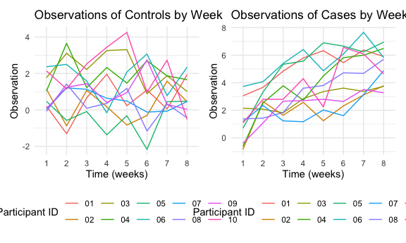

Homework 5
================
Natalie Boychuk
11/15/2020

## Problem 1

Read in the data

``` r
  homicide_df = 
    read_csv("data/homicide-data.csv") %>% 
    mutate(
      city_state = str_c(city, state, sep = "_"),
      resolved = case_when(
        disposition == "Closed without arrest" ~ "unsolved",
        disposition == "Open/No arrest" ~ "unsolved",
        disposition == "Closed by arrest" ~ "solved"
        )
    ) %>% select(city_state,resolved) %>% 
  filter(city_state != "Tulsa_AL")
```

    ## Parsed with column specification:
    ## cols(
    ##   uid = col_character(),
    ##   reported_date = col_double(),
    ##   victim_last = col_character(),
    ##   victim_first = col_character(),
    ##   victim_race = col_character(),
    ##   victim_age = col_character(),
    ##   victim_sex = col_character(),
    ##   city = col_character(),
    ##   state = col_character(),
    ##   lat = col_double(),
    ##   lon = col_double(),
    ##   disposition = col_character()
    ## )

### Description of the Raw Data

The raw data from the Washington Post homicide dataset includes 52178
rows and 2 columns and is focused on unsolved homicides throughout the
United States. The dataset includes the victims’ first and last names,
their race, age, sex, the reported date of the homicide, city and state
in which the homicide occurred, as well as a unique ID. The data is
already relatively clean.

``` r
aggregate_df = 
  homicide_df %>% 
  group_by(city_state) %>% 
  summarize(
    hom_total = n(),
    hom_unsolved = sum(resolved == "unsolved")
  ) 
```

    ## `summarise()` ungrouping output (override with `.groups` argument)

``` r
prop.test(
  aggregate_df %>%  filter(city_state == "Baltimore_MD") %>% pull(hom_unsolved),
   aggregate_df %>%  filter(city_state == "Baltimore_MD") %>% pull(hom_total)) %>% 
  broom::tidy()
```

    ## # A tibble: 1 x 8
    ##   estimate statistic  p.value parameter conf.low conf.high method    alternative
    ##      <dbl>     <dbl>    <dbl>     <int>    <dbl>     <dbl> <chr>     <chr>      
    ## 1    0.646      239. 6.46e-54         1    0.628     0.663 1-sample… two.sided

``` r
results_df = 
  aggregate_df %>% 
  mutate(
    prop_tests = map2(.x = hom_unsolved, .y = hom_total, ~prop.test(x = .x, n = .y)),
    tidy_tests = map(.x = prop_tests, ~broom::tidy(.x))
  ) %>% 
  select(-prop_tests) %>% 
  unnest(tidy_tests) %>% 
  select(city_state, estimate, conf.low,conf.high)
```

``` r
results_df %>% 
  mutate(city_state = fct_reorder(city_state, estimate)) %>% 
  ggplot(aes(x = city_state, y = estimate)) +
  geom_point() + 
  geom_errorbar(aes(ymin = conf.low, ymax = conf.high))
```


``` r
  theme(axis.text.x = element_text(angle = 90, vjust = 0.5, hjust = 1))
```

    ## List of 1
    ##  $ axis.text.x:List of 11
    ##   ..$ family       : NULL
    ##   ..$ face         : NULL
    ##   ..$ colour       : NULL
    ##   ..$ size         : NULL
    ##   ..$ hjust        : num 1
    ##   ..$ vjust        : num 0.5
    ##   ..$ angle        : num 90
    ##   ..$ lineheight   : NULL
    ##   ..$ margin       : NULL
    ##   ..$ debug        : NULL
    ##   ..$ inherit.blank: logi FALSE
    ##   ..- attr(*, "class")= chr [1:2] "element_text" "element"
    ##  - attr(*, "class")= chr [1:2] "theme" "gg"
    ##  - attr(*, "complete")= logi FALSE
    ##  - attr(*, "validate")= logi TRUE

## Problem 2

``` r
longstudy_df = 
  tibble(
  path = list.files("data/experiment-data")) %>% 
  mutate(
    path = str_c("data/experiment-data/", path),
    data = map(.x = path, ~read_csv(.x))) %>% 
      separate(path, c("file1","file2","name"), sep = "/") %>% 
      separate(name, c("arm","id","csv")) %>% 
         mutate(arm = recode(arm, con = "control", exp = "case")) %>% 
            select(-file1, -file2, -csv) %>% 
  unnest(data) %>% 
  pivot_longer(week_1:week_8,
               names_to = "week",
               values_to = "observation",
               names_prefix = "week_")
```

    ## Parsed with column specification:
    ## cols(
    ##   week_1 = col_double(),
    ##   week_2 = col_double(),
    ##   week_3 = col_double(),
    ##   week_4 = col_double(),
    ##   week_5 = col_double(),
    ##   week_6 = col_double(),
    ##   week_7 = col_double(),
    ##   week_8 = col_double()
    ## )
    ## Parsed with column specification:
    ## cols(
    ##   week_1 = col_double(),
    ##   week_2 = col_double(),
    ##   week_3 = col_double(),
    ##   week_4 = col_double(),
    ##   week_5 = col_double(),
    ##   week_6 = col_double(),
    ##   week_7 = col_double(),
    ##   week_8 = col_double()
    ## )
    ## Parsed with column specification:
    ## cols(
    ##   week_1 = col_double(),
    ##   week_2 = col_double(),
    ##   week_3 = col_double(),
    ##   week_4 = col_double(),
    ##   week_5 = col_double(),
    ##   week_6 = col_double(),
    ##   week_7 = col_double(),
    ##   week_8 = col_double()
    ## )
    ## Parsed with column specification:
    ## cols(
    ##   week_1 = col_double(),
    ##   week_2 = col_double(),
    ##   week_3 = col_double(),
    ##   week_4 = col_double(),
    ##   week_5 = col_double(),
    ##   week_6 = col_double(),
    ##   week_7 = col_double(),
    ##   week_8 = col_double()
    ## )
    ## Parsed with column specification:
    ## cols(
    ##   week_1 = col_double(),
    ##   week_2 = col_double(),
    ##   week_3 = col_double(),
    ##   week_4 = col_double(),
    ##   week_5 = col_double(),
    ##   week_6 = col_double(),
    ##   week_7 = col_double(),
    ##   week_8 = col_double()
    ## )
    ## Parsed with column specification:
    ## cols(
    ##   week_1 = col_double(),
    ##   week_2 = col_double(),
    ##   week_3 = col_double(),
    ##   week_4 = col_double(),
    ##   week_5 = col_double(),
    ##   week_6 = col_double(),
    ##   week_7 = col_double(),
    ##   week_8 = col_double()
    ## )
    ## Parsed with column specification:
    ## cols(
    ##   week_1 = col_double(),
    ##   week_2 = col_double(),
    ##   week_3 = col_double(),
    ##   week_4 = col_double(),
    ##   week_5 = col_double(),
    ##   week_6 = col_double(),
    ##   week_7 = col_double(),
    ##   week_8 = col_double()
    ## )
    ## Parsed with column specification:
    ## cols(
    ##   week_1 = col_double(),
    ##   week_2 = col_double(),
    ##   week_3 = col_double(),
    ##   week_4 = col_double(),
    ##   week_5 = col_double(),
    ##   week_6 = col_double(),
    ##   week_7 = col_double(),
    ##   week_8 = col_double()
    ## )
    ## Parsed with column specification:
    ## cols(
    ##   week_1 = col_double(),
    ##   week_2 = col_double(),
    ##   week_3 = col_double(),
    ##   week_4 = col_double(),
    ##   week_5 = col_double(),
    ##   week_6 = col_double(),
    ##   week_7 = col_double(),
    ##   week_8 = col_double()
    ## )
    ## Parsed with column specification:
    ## cols(
    ##   week_1 = col_double(),
    ##   week_2 = col_double(),
    ##   week_3 = col_double(),
    ##   week_4 = col_double(),
    ##   week_5 = col_double(),
    ##   week_6 = col_double(),
    ##   week_7 = col_double(),
    ##   week_8 = col_double()
    ## )
    ## Parsed with column specification:
    ## cols(
    ##   week_1 = col_double(),
    ##   week_2 = col_double(),
    ##   week_3 = col_double(),
    ##   week_4 = col_double(),
    ##   week_5 = col_double(),
    ##   week_6 = col_double(),
    ##   week_7 = col_double(),
    ##   week_8 = col_double()
    ## )
    ## Parsed with column specification:
    ## cols(
    ##   week_1 = col_double(),
    ##   week_2 = col_double(),
    ##   week_3 = col_double(),
    ##   week_4 = col_double(),
    ##   week_5 = col_double(),
    ##   week_6 = col_double(),
    ##   week_7 = col_double(),
    ##   week_8 = col_double()
    ## )
    ## Parsed with column specification:
    ## cols(
    ##   week_1 = col_double(),
    ##   week_2 = col_double(),
    ##   week_3 = col_double(),
    ##   week_4 = col_double(),
    ##   week_5 = col_double(),
    ##   week_6 = col_double(),
    ##   week_7 = col_double(),
    ##   week_8 = col_double()
    ## )
    ## Parsed with column specification:
    ## cols(
    ##   week_1 = col_double(),
    ##   week_2 = col_double(),
    ##   week_3 = col_double(),
    ##   week_4 = col_double(),
    ##   week_5 = col_double(),
    ##   week_6 = col_double(),
    ##   week_7 = col_double(),
    ##   week_8 = col_double()
    ## )
    ## Parsed with column specification:
    ## cols(
    ##   week_1 = col_double(),
    ##   week_2 = col_double(),
    ##   week_3 = col_double(),
    ##   week_4 = col_double(),
    ##   week_5 = col_double(),
    ##   week_6 = col_double(),
    ##   week_7 = col_double(),
    ##   week_8 = col_double()
    ## )
    ## Parsed with column specification:
    ## cols(
    ##   week_1 = col_double(),
    ##   week_2 = col_double(),
    ##   week_3 = col_double(),
    ##   week_4 = col_double(),
    ##   week_5 = col_double(),
    ##   week_6 = col_double(),
    ##   week_7 = col_double(),
    ##   week_8 = col_double()
    ## )
    ## Parsed with column specification:
    ## cols(
    ##   week_1 = col_double(),
    ##   week_2 = col_double(),
    ##   week_3 = col_double(),
    ##   week_4 = col_double(),
    ##   week_5 = col_double(),
    ##   week_6 = col_double(),
    ##   week_7 = col_double(),
    ##   week_8 = col_double()
    ## )
    ## Parsed with column specification:
    ## cols(
    ##   week_1 = col_double(),
    ##   week_2 = col_double(),
    ##   week_3 = col_double(),
    ##   week_4 = col_double(),
    ##   week_5 = col_double(),
    ##   week_6 = col_double(),
    ##   week_7 = col_double(),
    ##   week_8 = col_double()
    ## )
    ## Parsed with column specification:
    ## cols(
    ##   week_1 = col_double(),
    ##   week_2 = col_double(),
    ##   week_3 = col_double(),
    ##   week_4 = col_double(),
    ##   week_5 = col_double(),
    ##   week_6 = col_double(),
    ##   week_7 = col_double(),
    ##   week_8 = col_double()
    ## )
    ## Parsed with column specification:
    ## cols(
    ##   week_1 = col_double(),
    ##   week_2 = col_double(),
    ##   week_3 = col_double(),
    ##   week_4 = col_double(),
    ##   week_5 = col_double(),
    ##   week_6 = col_double(),
    ##   week_7 = col_double(),
    ##   week_8 = col_double()
    ## )

``` r
cases = 
  longstudy_df %>% 
  filter(arm == "case") %>% 
  mutate(as.numeric(week))

controls = 
  longstudy_df %>%
  filter(arm == "control") %>% 
  mutate(as.numeric(week))

case_plot = ggplot(data = cases, aes(x = week, y = observation, group = id)) + geom_line(aes(color = id)) + 
  labs(
    title = "Observations of Cases by Week",
    x = "Time (weeks)",
    y = "Observation"
  ) + 
  scale_color_hue(name = "Participant ID")

control_plot = ggplot(data = controls, aes(x = week, y = observation, group = id)) + geom_line(aes(color = id)) + 
  labs(
    title = "Observations of Controls by Week",
    x = "Time (weeks)",
    y = "Observation"
  ) + 
  scale_color_hue(name = "Participant ID")

control_plot + case_plot
```



## Problem 3

``` r
simfun = function(samp_size = 30, mu = 0, sigma = 5){
  
  prob3_data = 
    tibble(
      x = rnorm(n = samp_size, mean = mu, sd = sigma)
    ) 
  
    prob3_ttest = 
     t.test(prob3_data, conf.level = .95) %>% 
      broom::tidy()
}
```

``` r
mu_sim =
  tibble(
    mu = c(0, 1, 2, 3, 4, 5, 6)
  ) %>% 
  mutate(
    result = map(.x = mu, ~rerun(5, simfun(mu = .x))),
    result_df = map(result, bind_rows)
  ) 
```

``` r
unnest(mu_sim, cols = c("result_df"))
```

    ## # A tibble: 35 x 10
    ##       mu result estimate statistic p.value parameter conf.low conf.high method
    ##    <dbl> <list>    <dbl>     <dbl>   <dbl>     <dbl>    <dbl>     <dbl> <chr> 
    ##  1     0 <list…    0.412     0.489  0.629         29   -1.31     2.14   One S…
    ##  2     0 <list…    0.664     0.914  0.368         29   -0.821    2.15   One S…
    ##  3     0 <list…    0.551     0.629  0.534         29   -1.24     2.34   One S…
    ##  4     0 <list…    0.567     0.704  0.487         29   -1.08     2.21   One S…
    ##  5     0 <list…   -1.65     -1.96   0.0599        29   -3.37     0.0731 One S…
    ##  6     1 <list…    2.19      2.27   0.0310        29    0.214    4.16   One S…
    ##  7     1 <list…    1.33      1.35   0.188         29   -0.691    3.36   One S…
    ##  8     1 <list…   -0.190    -0.205  0.839         29   -2.08     1.70   One S…
    ##  9     1 <list…    1.12      1.32   0.197         29   -0.616    2.86   One S…
    ## 10     1 <list…    1.68      1.79   0.0834        29   -0.237    3.60   One S…
    ## # … with 25 more rows, and 1 more variable: alternative <chr>

``` r
power_list = 
  mu_sim %>% 
mutate(decision = case_when(
  "p.value" < .05 ~ "reject",
  "p.value" > .05 ~ "fail.reject")) %>% 
  mutate(power_var = 
           (mean(decision == "reject"))
  ) 
```

``` r
power_list %>% 
  group_by(mu) %>% 
  ggplot(aes(x = mu, y = power_var)) +
  geom_point() + 
  labs(
    title = "Relationship Between Effect Size and True Mean (Mu)",
    x = "True Mean", 
    y = "Power"
  )
```


``` r
plot1 = 
  unnest(power_list, result_df) %>% 
  group_by(mu) %>% 
  #summarise(mean_observed = mean(estimate)) %>% 
  ggplot(aes(x = mu, y = "estimate")) + 
  geom_point() + 
  labs(
    title = "Relationship between True Mean (mu) and Estimated Mean",
    x = "True mean",
    y = "Estimated mean"
  )

plot2 = 
  power_list %>% 
  group_by(mu) %>% 
  filter(
    decision == "fail.reject"
  ) %>% 
  #summarise(mean_reject = mean(estimate)) %>% 
  ggplot(aes(x = mu, y = "estimate")) + 
  geom_point() + 
   labs(
    title = "Relationship between True Mean (mu) and Estimated Mean",
    x = "True mean",
    y = "Estimated mean"
  )

plot1 + plot2
```


I am really sorry I couldn’t get the plots to work - I tried my best but
my brain is fried now :(

If these plots had worked, I would assume that our first plot would show
that as the effect size gets larger, the power would also increase.

The second plot would probably show that the sample average of mu across
tests for which the null is rejected is different from the true value of
mu, because these are tests in which we have rejected the null
hypothesis. To reject the null hypothesis means that there is sufficient
evidence to suggest that the observed value is significantly different
from mu.
